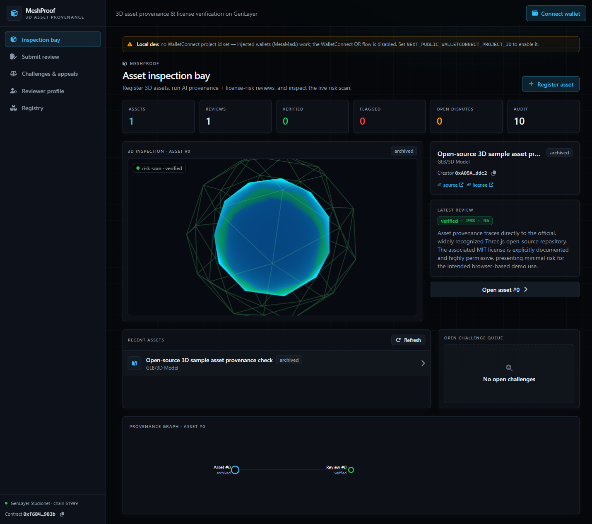
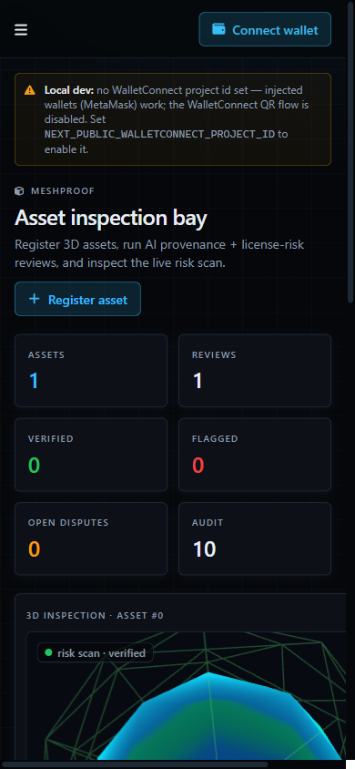

# MeshProof

MeshProof is a GenLayer protocol and inspection console for 3D asset provenance. It is built for teams that need to verify whether a model, scan, kitbash, texture pack, or marketplace asset can safely enter production without hidden license risk.

The app pairs a 3D inspection bay with an on-chain review workflow: creators register assets, reviewers submit source and license evidence, GenLayer reads the public evidence, the contract produces a provenance verdict, and disputed reviews can move through challenge and appeal before finalization.



## Why It Exists

3D teams often inherit asset files with unclear origin: marketplace listings, AI-assisted kitbashes, old studio libraries, scraped reference packs, or vendor drops. MeshProof gives those assets a public evidence trail instead of a private spreadsheet.

The contract does not simply store metadata. It coordinates reviews, challenges, appeals, reviewer reputation, lifecycle state, and audit records around the public URLs that support an asset's provenance claim.

## Live Deployment

| Item | Value |
| --- | --- |
| Network | GenLayer Studionet |
| Chain ID | `61999` |
| Contract | `0xf684Ab541b8a340D74E79c17d56a06F6d3cb983b` |
| Contract Explorer | https://explorer-studio.genlayer.com/contracts/0xf684Ab541b8a340D74E79c17d56a06F6d3cb983b |
| Deploy TX | `0x4023aac9d766675e9eed502a338edfb152dc3392187f52fffaad4990840e559b` |
| Deployed | `2026-06-22T14:39:42.171Z` |

## Product Surface

- Inspection bay with a live React Three Fiber asset scanner.
- Registry view for recent, verified, and flagged assets.
- Review submission flow for source, license, preview, and note evidence.
- Asset detail pages with reviews, challenges, appeals, and audit trail.
- D3 provenance graph connecting assets to reviews and disputes.
- Reviewer profile view with reputation and review history.
- RainbowKit wallet connection on GenLayer Studionet.



## Contract Capabilities

The deployed `MeshProof.py` contract manages the full verification lifecycle:

- `register_asset` creates an asset dossier with source/license/preview URLs.
- `submit_review` records a reviewer claim and evidence note.
- `assess_review` uses GenLayer web + LLM consensus to score provenance and license risk.
- `challenge_review` opens a counter-claim against a review.
- `file_appeal` escalates unresolved decisions.
- `resolve_challenge` and `resolve_appeal` settle disputes with GenLayer reasoning.
- `finalize_asset`, `retire_asset`, and `archive_asset` close lifecycle states.
- Read methods expose public stats, recent assets, verified/flagged indexes, asset reviews, audit trails, profiles, challenges, and appeals.

## Architecture

```text
app/                 Next.js App Router pages
components/          3D inspector, provenance graph, shell, wallet, transaction UI
lib/                 GenLayer client, Studionet chain config, formatters, typed readers
contracts/           Deployed GenLayer contract source
docs/                README screenshots
deployment.json      Public deployment and smoke-test metadata
```

The frontend defaults to the deployed Studionet contract from `lib/deployment.ts`. `NEXT_PUBLIC_CONTRACT_ADDRESS` is optional and only needed when testing another deployment.

## Local Development

```powershell
npm install
copy .env.local.example .env.local
npm run dev
```

Open:

```text
http://localhost:4800
```

Injected wallets such as MetaMask work without a WalletConnect project ID. Add `NEXT_PUBLIC_WALLETCONNECT_PROJECT_ID` only if you want WalletConnect QR support.

## Production Deploy

This is a standard Next.js application.

Recommended Vercel settings:

| Setting | Value |
| --- | --- |
| Framework Preset | Next.js |
| Build Command | `npm run build` |
| Output Directory | `.next` |
| Environment Variables | None required |

The deployed contract address is public and compiled into the app as a fallback, so Vercel does not need private secrets.

## Security Notes

- No private keys, vault files, seed phrases, or wallet dumps belong in this repository.
- All included addresses and transaction hashes are public Studionet metadata.
- The app only asks the connected wallet to sign user-triggered writes.
- Public source and license URLs are rendered as external links and opened with `rel="noreferrer"`.
- The contract prompts instruct GenLayer to treat evidence pages as data and ignore prompt-injection text inside them.
- `vercel.json` adds production security headers for frame blocking, MIME sniff protection, referrer policy, permissions policy, and HSTS.

Run the local safety check before pushing:

```powershell
npm run security:scan
```

## Verification

The deployed smoke path covered:

```text
register_asset
submit_review
assess_review
challenge_review
file_appeal
resolve_challenge
resolve_appeal
finalize_asset
retire_asset
archive_asset
```

The current frontend reads live Studionet state and remains usable even when the registry is empty or Studionet is temporarily busy.
